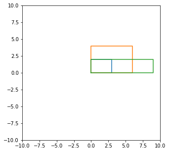

```python
import aHuTrans as at
import matplotlib.pyplot as plt
import numpy as np

```


```python
# 定义三个图形，并在同一张图中画出
rec1 =  at.get_shape.rectangle((0, 0), 3, 2)

tri1 = at.get_shape.triangle_3p((0, 0), (0, 3), (4, 0))

cir1 = at.get_shape.circle((2,2), 2)

at.draw_shape.draw(rec1, useDefaultCanvas=True, isNewFig=True)
at.draw_shape.draw(tri1)
at.draw_shape.draw(cir1)
```


    

    


```python
# 对矩形进行规则与不规则缩放
at.draw_shape.draw(rec1, useDefaultCanvas=True, isNewFig=True)
rec1.zoom(2)
at.draw_shape.draw(rec1)
rec1.zoom((1.5,0.5))
at.draw_shape.draw(rec1)
```


    

    


```python
# 对三角形进行正90°旋转
at.draw_shape.draw(tri1, useDefaultCanvas=True, isNewFig=True)
tri1.rotate(np.pi / 2)
at.draw_shape.draw(tri1)

```


    

    


```python
# 对圆形关于y轴翻转
at.draw_shape.draw(cir1, useDefaultCanvas=True, isNewFig=True)
cir1.flip('y')
at.draw_shape.draw(cir1)
```


    

    

